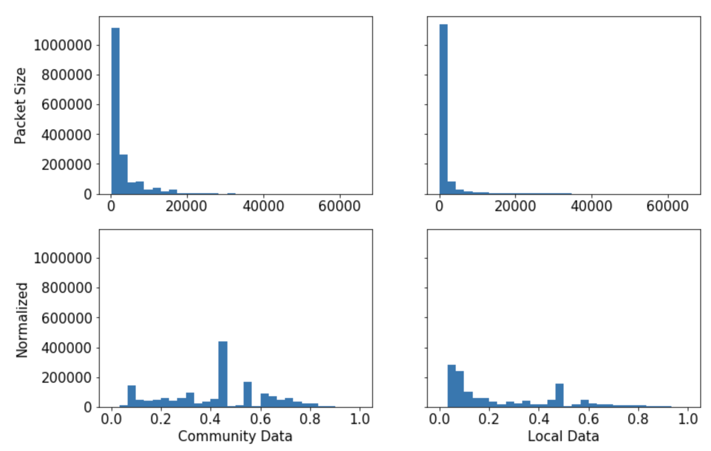
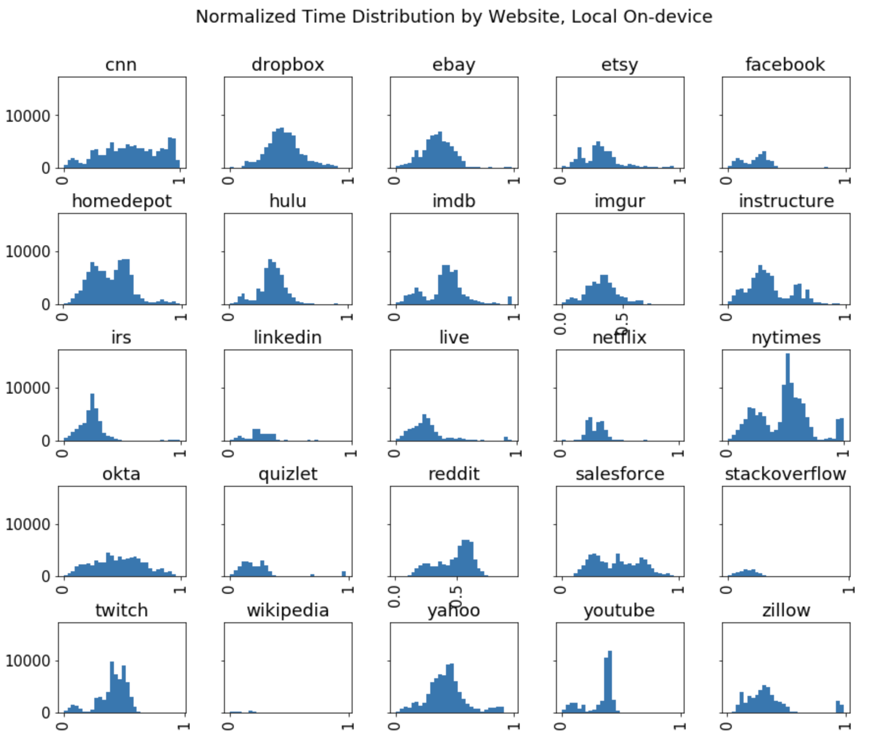
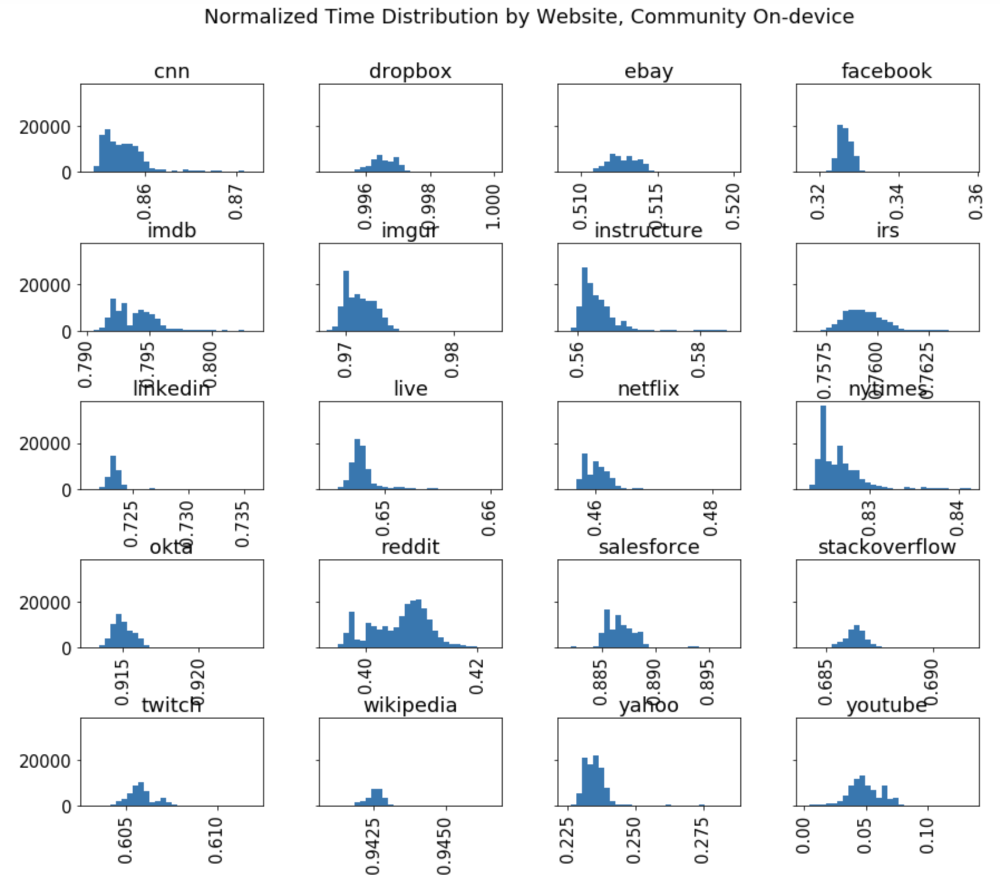

# Project 2 Part 2 Report

*Jeff Qiu*

*Jun 3, 2020*

## Model

### Program Structure

The program consists of four parts. In the first part, we use a preprocessing function to extract features and separating features with labels. Next, we build a K-nearest neighbor classifier with the appropriate parameter and train the model with our training data. Lastly, we predict the classification for testing data and compare them with the testing labels. 

### Features

The original dataset contains three features: `time`, `direction` and `packet_size`. We first convert the aboslute time in `time` to relative time by subtracting the current row's time and the previous row's time if the current time is not 0. This ensures all times represent either the first packet of a sequence of packets from the same website traffic, or the delay of current packet compare to the previous one. 

Second, we take the log of `packet_size` and the square root of `time`, then using min-max normalization to normalize all data to range between 1 and 0. We choose the transformation functions base on the observation of their distribution. 

As shown in figure 1, the distribution for `packet_size` is clearly skewed on the left side, making features less distinguishable. After taking the log of original data, the numbers are more spread out and have more distinction. 

We also decide to drop `direction` as a feature, as it seems to have trivial effect on the model's accuracy and significantly prolongs training time.

### Model

We originally attempted using deep neural network to solve the problem, but a DNN model consistently yields an accuracy rate of around 5%, which is not significantly different from random labeling. Therefore, we choose K-nearest neighbor model because it is recommended by the instructors and papers listed in the requirement. 

## Results and Discussion

### Local vs. Community 
As shown in Table 1, the community model is 80% more accurate than the local model. We believe the reason may be the difference in the distribution of `time_normal` feature.

As shown in the figure 2 and 3, compared with community data, the normalized time feature in local data has relatively wide distribution with similar means and standard deviations. Distributions for most websites are normal, span across 0 to 1, and have a mean of around 0.5. Whereas in the community data, the distributions are very distributed and localized () in a small range, making them more distinct.

### On-device vs. Wifi-sniffing

Overall, both model performs poorly for the sniffer data, with the community model performing slightly better. Considering the accuracy of community model in predicting its own data, we will assume the model to be robust in this discussion. 

There are several factors that might contribute to the inaccuracy in sniffer data. The sniffer data is limited to 2 rows per website. This means that zeroing `time` base on previous packet can be inaccurate, since if packets in between the two packets in data are lost, the delay will be exaggerated. In addition, the min-max normalization adjust data base on its relative magnitude in the whole dataset. If the `time` feature for sniffer data have different range, the normalization might distort the features and make them unrecognizable for the model.

## Figures and Tables

### Figure 1: Distribution of `packet_size` before and after Normalization

### Figure 2: Normalized Time Distribution by Website for Local On-device Data

### Figure 3: Normalized Time Distribution by Website for Community On-device Data

### Table 1: Community vs. Local Model Accuracy 
| Website       | Accuracy - Community | Accuracy - Local |
|---------------|----------------------|------------------|
| cnn           | 100.000000           | 34.332724        |
| dropbox       | 100.000000           | 21.477769        |
| ebay          | 100.000000           | 15.295318        |
| facebook      | 100.000000           | 22.445019        |
| imdb          | 100.000000           | 13.388100        |
| imgur         | 100.000000           | 13.302131        |
| instructure   | 100.000000           | 17.045924        |
| irs           | 100.000000           | 27.409624        |
| linkedin      | 100.000000           | 3.510583         |
| live          | 99.994144            | 25.001504        |
| netflix       | 100.000000           | 15.066510        |
| nytimes       | 100.000000           | 25.476668        |
| okta          | 100.000000           | 11.431730        |
| reddit        | 100.000000           | 31.267835        |
| salesforce    | 100.000000           | 9.604725         |
| stackoverflow | 99.995105            | 2.619903         |
| twitch        | 100.000000           | 12.472585        |
| wikipedia     | 99.979214            | 3.652968         |
| yahoo         | 100.000000           | 7.643149         |
| youtube       | 100.000000           | 48.559732        |
| zillow        | N/A                  | 8.132822         |
| homedepot     | N/A                  | 30.572870        |
| etsy          | N/A                  | 10.017917        |
| hulu          | N/A                  | 11.061006        |
| quizlet       | N/A                  | 18.291176        |
| Average      | 99.99932             | 19.712967        | 

### Table 2: Wifi-sniffing Prediction Accuracy

| Website       | Accuracy - Community | Accuracy - Local |
|---------------|----------------------|------------------|
| cnn           | 0.0                  | 0.50         |
| dropbox       | 0.0                  | 9.50         |
| etsy          | 0.0                  | 0.55         |
| facebook      | 0.0                  | 0.00         |
| homedepot     | 0.0                  | 19.25        |
| hulu          | 0.0                  | 6.21         |
| imgur         | 0.0                  | 4.50         |
| instructure   | 0.0                  | 4.50         |
| irs           | 0.0                  | 7.50         |
| linkedin      | 0.0                  | 0.00         |
| nytimes       | 0.0                  | 5.50         |
| okta          | 0.0                  | 3.50         |
| quizlet       | 0.0                  | 21.00        |
| reddit        | 29.0                 | 4.50         |
| salesforce    | 0.0                  | 1.00         |
| stackoverflow | 0.0                  | 0.00         |
| wikipedia     | 0.0                  | 0.00         |
| yahoo         | 88.0                 | 1.50         |
| youtube       | 9.0                  | 3.00         |
| Average      | 7.16             | 4.97        |   
